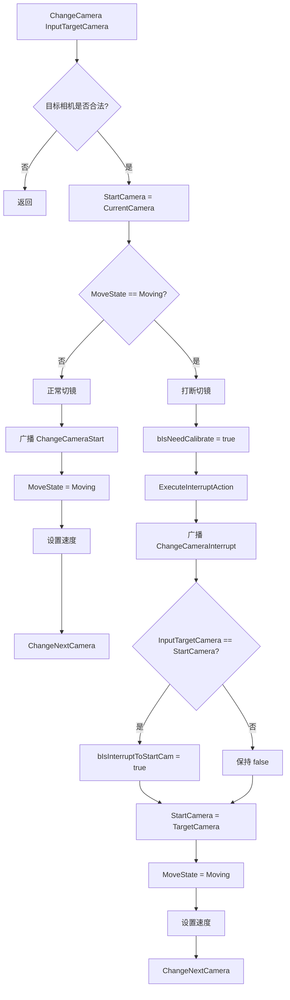
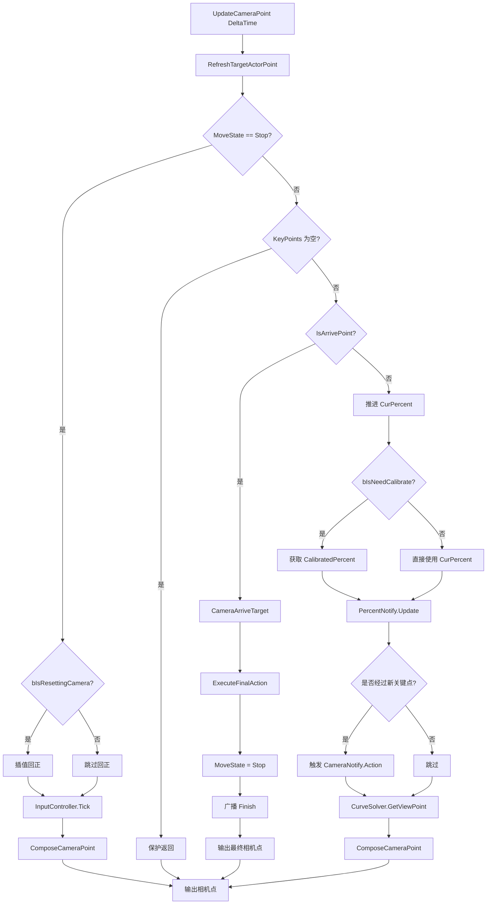

# NSCamera 代码导读

> NSCamera 是一个 **Unreal Engine 插件**，实现了一套 **HMI（人机交互）电影级相机系统**。
> 核心能力是：通过 **DataTable + 关键点 + 曲线** 驱动多个预设镜头之间的平滑运镜，并支持 **触摸交互、打断校准、关键点通知、百分比通知、视图偏移**。

---

## 一、先用一句话理解这个插件

可以把 NSCamera 理解成一套“**围绕目标 Actor 的数据驱动相机状态机**”：

- 配置层用 `FHMICameraConfig` 描述“从哪个镜头切到哪个镜头”
- 运行时由 `AHMICameraManager` 负责切镜、推进百分比、触发通知、输出最终相机点
- `UHMICameraCurveSolver` 负责把离散关键点变成可采样曲线
- `UHMICameraInputController` 负责用户输入带来的旋转、缩放、惯性和回正
- `UShiftCameraModifier` 负责只改投影、不改相机位置的视图偏移

---

## 二、建议阅读顺序

按下面顺序读，建立整体认知最快：

| 顺序 | 文件 | 作用 |
|:---:|---|---|
| 1 | `Public/HMICameraTypes.h` | 基础数据结构和枚举，先建立数据模型 |
| 2 | `Public/HMICameraDelegates.h` | 委托和事件机制 |
| 3 | `Public/HMICameraNotify.h` | 蓝图通知扩展点 |
| 4 | `Public/HMICameraManager.h` | 核心总控类声明，最重要 |
| 5 | `Private/HMICameraManager.Config.cpp` | 初始化、配置装载、切镜准备 |
| 6 | `Private/HMICameraManager.Core.cpp` | 切镜状态机与每帧推进 |
| 7 | `Public/HMICameraCurveSolver.h` + `.cpp` | 曲线求解与校准算法 |
| 8 | `Public/HMICameraInputController.h` + `.cpp` | 交互输入和惯性/回正 |
| 9 | `Modify/ShiftCameraModifier.h` + `.cpp` | 视图偏移 |

建议的阅读节奏：

1. 先读 `Types`，知道“系统里有哪些数据”
2. 再读 `Manager.h`，知道“系统对外提供什么能力”
3. 再读 `Config.cpp + Core.cpp`，知道“系统是怎么跑起来的”
4. 最后读 `CurveSolver` 和 `InputController`，补上“路径怎么算、输入怎么作用”

---

## 三、项目结构总览

```text
Source/NSCamera/
├── Public/
│   ├── HMICameraTypes.h
│   ├── HMICameraDelegates.h
│   ├── HMICameraNotify.h
│   ├── HMICameraManager.h
│   ├── HMICameraCurveSolver.h
│   ├── HMICameraInputController.h
│   └── NSCamera.h
├── Private/
│   ├── HMICameraManager.cpp
│   ├── HMICameraManager.Config.cpp
│   ├── HMICameraManager.Core.cpp
│   ├── HMICameraManager.Input.cpp
│   ├── HMICameraManager.Calibration.cpp
│   ├── HMICameraManager.Debug.cpp
│   ├── HMICameraManager.Logging.cpp
│   ├── HMICameraManager.ViewShift.cpp
│   ├── HMICameraCurveSolver.cpp
│   ├── HMICameraInputController.cpp
│   └── NSCamera.cpp
├── Modify/
│   ├── ShiftCameraModifier.h
│   └── ShiftCameraModifier.cpp
└── NSCamera.Build.cs
```

从职责上可以粗分为 4 层：

- `Types / Delegates / Notify`：基础定义层
- `Manager`：总控调度层
- `CurveSolver / InputController`：子系统能力层
- `Modifier`：最终渲染表现层

---

## 四、核心类型速查

### 4.1 `FHMICameraPoint`

系统中最基础的数据单元，描述一个相机姿态：

```cpp
struct FHMICameraPoint
{
    FVector LocationOffset;
    FRotator RotationOffset;
    float FOV;
};
```

用途：

- 作为关键点数据
- 作为曲线采样结果
- 作为用户输入偏移容器
- 作为最终输出相机点

它在运行态里有 4 个重要角色：

- `TargetActorPoint`：目标 Actor 参考点
- `RelativePoint`：曲线采样出来的基准镜头点
- `RelativePointOffset`：用户输入附加偏移
- `CurrentCameraPoint`：最终输出点

### 4.2 `FHMICameraConfig`

每一行 `DataTable` 配置都对应一次完整切镜：

| 字段 | 说明 |
|---|---|
| `KeyPoints` | 关键点数组 |
| `CameraNotifys` | 关键点索引到 `UCameraNotify` 子类的映射 |
| `PercentNotify` | 整段运镜的百分比通知类 |
| `TotalTime` | 运镜总时长 |
| `LocationCurveBase` | 正常切镜的位置曲线 |
| `RotationCurveBase` | 正常切镜的旋转曲线 |
| `InterruptedLocationCurveBase` | 打断切镜时的位置曲线 |
| `InterruptedRotationCurveBase` | 打断切镜时的旋转曲线 |
| `RowName` | 运行时回写的实际命中行名 |

`DataTable` 行名约定：

```text
StartCamera_TargetCamera
```

例如：

```text
Default_Driving
Planet_DrivingAssistancePilot
```

系统先查精确匹配，不存在时再回退到：

```text
Default_TargetCamera
```

### 4.3 核心枚举

| 枚举 | 值 | 用途 |
|---|---|---|
| `ECameraMove` | `Moving / Stop` | 相机是否处于切镜中 |
| `ECurveType` | `CurveFloat / CurveVector / CurveBase` | 配置曲线的具体类型 |
| `ECameraInteractionState` | `None / Orbiting / Zooming` | 输入交互状态 |

---

## 五、类关系图

```text
AHMICameraManager (APlayerCameraManager)
 ├── UHMICameraCurveSolver
 │    ├── 关键点曲线生成
 │    ├── 百分比采样
 │    └── 打断校准
 │
 ├── UHMICameraInputController
 │    ├── 环绕旋转
 │    ├── 缩放
 │    ├── 惯性阻尼
 │    └── 回正
 │
 ├── UShiftCameraModifier
 │    └── 视图偏移（改投影，不改相机位置）
 │
 ├── UCameraNotify*
 │    └── 关键点离散事件
 │
 └── UPercentNotify*
      └── 运镜过程连续事件
```

一句话总结关系：

- `AHMICameraManager` 是总控
- `CurveSolver` 决定“路径怎么走”
- `InputController` 决定“用户怎么扰动路径”
- `Notify` 决定“路上触发什么事件”
- `Modifier` 决定“最终画面怎么偏移显示”

---

## 六、Manager 时序总览

这一节是阅读 `HMICameraManager.Config.cpp` 和 `HMICameraManager.Core.cpp` 的核心入口。

### 6.1 完整总流程图

```mermaid
flowchart TD
    A[BeginPlay 启动] --> B{CameraConfigDataTable 是否有效?}

    B -- 否 --> B1[LogE 并返回]
    B -- 是 --> C[创建 CurveSolver]
    C --> D[创建 InputController]
    D --> E[遍历 DataTable 所有行]

    E --> E1[InitCalibrationCameraKeyPointMap]
    E1 --> E2[创建并初始化 CameraNotifyMap]
    E2 --> E3[创建并初始化 PercentNotifyMap]
    E3 --> E4[解析 RowName 填充 CameraNameList]
    E4 --> F[添加 ViewShiftModifier]
    F --> G[进入运行态]

    G --> H[外部调用 ChangeCamera TargetCamera]
    H --> I{CheckInputCameraIsValid 是否通过?}

    I -- 否 --> I1[直接返回]
    I -- 是 --> J[StartCamera = CurrentCamera]
    J --> K{当前 MoveState 是否为 Moving?}

    K -- 否 --> K1[广播 ChangeCameraStart]
    K1 --> L[MoveState = Moving]
    K -- 是 --> K2[标记 bIsNeedCalibrate = true]
    K2 --> K3[ExecuteInterruptAction]
    K3 --> K4[广播 ChangeCameraInterrupt]
    K4 --> K5{是否打断回原起点?}
    K5 -- 是 --> K6[bIsInterruptToStartCam = true]
    K5 -- 否 --> K7[保持 false]
    K6 --> K8[StartCamera = TargetCamera]
    K7 --> K8

    L --> M{是否首次播放?}
    K8 --> M
    M -- 是 --> M1[ChooseSpeed 100]
    M -- 否 --> M2[ChooseSpeed 1]
    M1 --> N[ChangeNextCamera]
    M2 --> N

    N --> N1[GetCameraConfigData 精确匹配]
    N1 --> N2{是否找到 Start_Target?}
    N2 -- 否 --> N3[回退查找 Default_Target]
    N2 -- 是 --> N4[复制到 CurrentCameraConfigData]
    N3 --> N5{是否找到 Default_Target?}
    N5 -- 否 --> N6[LogE 并返回空]
    N5 -- 是 --> N4

    N4 --> N7[RelativePoint = KeyPoints.Last]
    N7 --> N8[ClearRelativePointOffset]
    N8 --> N9[切换 CurrentNotifyMap]
    N9 --> N10[切换 CurrentPercentNotify]
    N10 --> N11[CurveSolver.GenKeyPointsCurve]
    N11 --> N12[SetupLocationCurves]
    N12 --> N13[SetupRotationCurves]
    N13 --> N14[重置 Percent 状态]

    N14 --> O{是否需要打断校准?}
    O -- 否 --> P[PassByKeyPointIndex = -2]
    O -- 是 --> O1[GenCalibrationCurve]
    O1 --> O2[GetCalibratedPercent]
    O2 --> O3[缩短 CameraMoveTotalTime]
    O3 --> P

    P --> Q[每帧调用 UpdateCameraPoint DeltaTime]
    Q --> R[RefreshTargetActorPoint]
    R --> S{MoveState 是否为 Stop?}

    S -- 是 --> S1{是否正在回正?}
    S1 -- 是 --> S2[插值 RelativePointOffset 回零]
    S1 -- 否 --> S3[跳过回正]
    S2 --> S4[InputController.Tick]
    S3 --> S4
    S4 --> S5{是否 Debug 路径追踪?}
    S5 -- 是 --> S6[TraceToDebugKeyPoint]
    S5 -- 否 --> S7[ComposeCameraPoint]
    S6 --> Z[输出 CurrentCameraPoint]
    S7 --> Z

    S -- 否 --> T{KeyPoints 是否为空?}
    T -- 是 --> T1[保护返回 CurrentCameraPoint]
    T1 --> Z
    T -- 否 --> U{IsArrivePoint 是否到达?}

    U -- 是 --> U1[CameraArriveTarget]
    U1 --> U2[ChangeCurPercent 1]
    U2 --> U3[ExecuteFinalAction]
    U3 --> U4[MoveState = Stop]
    U4 --> U5[清空 CurrentCameraConfigData.KeyPoints]
    U5 --> U6[CurrentCamera = TargetCamera]
    U6 --> U7[广播 ChangeCameraFinish]
    U7 --> U8[重置 PassByKeyPointIndex]
    U8 --> U9[bIsNeedCalibrate = false]
    U9 --> U10[StartCamera = TargetCamera]
    U10 --> U11[ComposeCameraPoint]
    U11 --> Z

    U -- 否 --> V{CurPercent < 1 ?}
    V -- 否 --> V9[保留当前点]
    V9 --> Z
    V -- 是 --> V1[LastPercent = CurPercent]
    V1 --> V2[计算 NextFrameIncreasePercent]
    V2 --> V3[ChangeCurPercent]
    V3 --> V4{是否处于校准流程?}
    V4 -- 是 --> V5[OutPercent = GetCalibratedPercent]
    V4 -- 否 --> V6[OutPercent = CurPercent]
    V5 --> V7[PercentNotify.DoUpdatePercentAction]
    V6 --> V7
    V7 --> V8{是否经过新关键点?}
    V8 -- 是 --> V10[触发 CameraNotify.DoAction]
    V8 -- 否 --> V11[跳过]
    V10 --> V12[CurveSolver.GetViewPoint]
    V11 --> V12
    V12 --> V13[ComposeCameraPoint]
    V13 --> Z

    Z[输出 CurrentCameraPoint 给相机系统]
```



### 6.2 只看切镜入口：`ChangeCamera`



关键理解点：

- `ChangeCamera` 是切镜总入口
- 这里最重要的分支不是“切到哪个镜头”，而是“当前是不是已经在 Moving”
- 如果已经在 `Moving`，就不是正常切镜，而是“打断切镜”

### 6.3 只看每帧主循环：`UpdateCameraPoint`



关键理解点：

- `UpdateCameraPoint` 是每帧主循环
- `Stop` 分支处理“静止态、回正、输入惯性”
- `Moving` 分支处理“推进切镜、发通知、采样曲线、到达收尾”

---

## 七、核心数据流

### 7.1 初始化阶段：`BeginPlay`

```text
CameraConfigDataTable
  -> 检查是否为空
  -> 创建 CurveSolver
  -> 创建 InputController
  -> 遍历每一行 FHMICameraConfig
      -> InitCalibrationCameraKeyPointMap
      -> 创建 UCameraNotify 实例
      -> 创建 UPercentNotify 实例
      -> 填充 CameraNameList
  -> 添加 ViewShiftModifier
```

运行结果：

- 配置表被装载到运行态
- 所有通知对象被实例化
- 所有可用相机名被缓存
- 曲线系统和输入系统就绪

### 7.2 切镜准备阶段：`ChangeCamera -> ChangeNextCamera`

```text
调用 ChangeCamera(Target)
  -> 检查目标是否合法
  -> 判断是否为打断
  -> 进入 Moving
  -> 设置 SpeedRatio
  -> ChangeNextCamera(Target)
      -> 查找 DataTable 行
      -> 复制到 CurrentCameraConfigData
      -> 清空用户偏移
      -> 切换 CurrentNotifyMap / CurrentPercentNotify
      -> GenKeyPointsCurve
      -> SetupLocationCurves / SetupRotationCurves
      -> 如有打断则 GenCalibrationCurve
```

### 7.3 每帧推进阶段：`UpdateCameraPoint`

```text
UpdateCameraPoint(DeltaTime)
  -> RefreshTargetActorPoint
  -> 如果 Stop:
       -> 回正
       -> InputController.Tick
       -> ComposeCameraPoint
  -> 如果 Moving:
       -> IsArrivePoint?
       -> 推进 CurPercent
       -> 计算校准后的 OutPercent
       -> CurrentPercentNotify.DoUpdatePercentAction
       -> 检测经过的关键点并触发 CameraNotify.DoAction
       -> CurveSolver.GetViewPoint(CurPercent)
       -> ComposeCameraPoint
```

### 7.4 收尾阶段：`CameraArriveTarget`

```text
到达目标
  -> ChangeCurPercent(1.0)
  -> ExecuteFinalAction
  -> MoveState = Stop
  -> CurrentCamera = TargetCamera
  -> 广播 ChangeCameraFinish
  -> 清除打断校准标记
  -> StartCamera = TargetCamera
```

---

## 八、相机点三段式合成

最终输出给相机系统的 `CurrentCameraPoint` 不是单一来源，而是三段叠加：

```text
最终相机点 = TargetActorPoint + RelativePoint + RelativePointOffset
```

对应含义：

| 段 | 来源 | 含义 |
|---|---|---|
| `TargetActorPoint` | 每帧刷新 | 目标 Actor 的世界参考点 |
| `RelativePoint` | 曲线采样 | 运镜路径上的基准镜头点 |
| `RelativePointOffset` | 输入控制 | 用户旋转/缩放造成的附加扰动 |

如果存在 `TargetActor`，合成时还会多做 3 件事：

1. 根据 `bFollowTargetRotation` 决定是否把偏移旋转到目标朝向坐标系
2. 对最终位置做最小高度限制
3. 用 `LookAt + Roll` 生成最终朝向

所以这里不是简单相加，而是：

- 位置：目标系旋转后再叠加
- 朝向：始终看向目标，保留 Roll
- FOV：做线性叠加

---

## 九、关键子系统详解

### 9.1 曲线求解器：`UHMICameraCurveSolver`

核心职责：

- 将离散 `KeyPoints` 转成连续曲线
- 按百分比采样 `FHMICameraPoint`
- 处理中断切镜时的校准

核心接口：

- `GenKeyPointsCurve()`
- `SetupLocationCurves(...)`
- `SetupRotationCurves(...)`
- `GetViewPoint(float Percent)`
- `GenCalibrationCurve()`
- `GetCalibratedPercent()`
- `GetCurrentKeyPointIndex(float Percent)`

一句话理解：

`CurveSolver` 决定“在当前百分比下，镜头应该在路径上的哪个位置”。

### 9.2 输入控制器：`UHMICameraInputController`

核心职责：

- 处理单指环绕旋转
- 处理双指/滚轮缩放
- 处理松手后的惯性和阻尼
- 处理回正配合

交互状态机：

```text
None -> Orbiting -> None
None -> Zooming -> None
```

每帧主要做：

1. 惯性阻尼
2. 旋转偏移更新
3. 缩放插值
4. Roll 归零推进

一句话理解：

`InputController` 决定“用户如何在基准镜头上叠加临时偏移”。

### 9.3 通知系统：`UCameraNotify` / `UPercentNotify`

`UCameraNotify`：

- 面向关键点
- 是离散事件
- 典型时机：经过某个索引点、被打断、运镜结束

`UPercentNotify`：

- 面向整段运镜
- 是连续事件
- 典型时机：每帧百分比更新、被打断、运镜完成

一句话理解：

- `CameraNotify` 看“经过了哪个点”
- `PercentNotify` 看“当前走到了多少进度”

### 9.4 视图偏移：`UShiftCameraModifier`

核心职责：

- 修改投影矩阵偏心
- 让目标在屏幕上偏左、偏右、偏上、偏下显示
- 不直接改相机世界坐标

一句话理解：

这是“构图层”的偏移，不是“物理镜头位置”的偏移。

---

## 十、委托与事件系统

`HMICameraDelegates.h` 提供了一套委托宏，用于减少样板代码。

以 `HMICameraManager` 为例，系统同时提供两类事件通道：

### 10.1 给 C++ 用的委托

- `DelegateChangeCameraStartMC`
- `DelegateChangeCameraInterruptMC`
- `DelegateChangeCameraFinishMC`
- `DelegateCameraLocationUpdateMC`

特点：

- 性能更高
- 不走反射
- 适合纯 C++ 订阅

### 10.2 给蓝图用的事件

- `ChangeCameraStart`
- `ChangeCameraInterrupt`
- `ChangeCameraFinish`
- `FOnOrbitRollResetPercent`

特点：

- 可蓝图绑定
- 更适合 UI、特效、美术逻辑

---

## 十一、打断校准机制

这是系统里最复杂、也最关键的设计之一。

问题背景：

- 如果当前正在从 A 切到 B
- 这时用户又要求切到 C
- 不能让镜头瞬间跳到新路径，否则视觉会断裂

系统的做法是：

```text
1. 标记 bIsNeedCalibrate = true
2. 对旧路径执行 ExecuteInterruptAction
3. 广播 ChangeCameraInterrupt
4. 用新目标重新执行 ChangeNextCamera
5. CurveSolver 生成新的关键点曲线
6. 再生成一条校准曲线
7. 计算当前位置在新路径上的校准百分比
8. 后续每帧推进时：
     - 内部仍推进 CurPercent
     - 对外通知使用 CalibratedPercent
9. 随着推进继续，镜头平滑接入新路径
```

可以把它理解成：

- `CurPercent` 是内部推进进度
- `CalibratedPercent` 是打断后重新映射过的语义进度

这样做的好处是：

- 路径连续
- 通知连续
- 视觉上不跳变

---

## 十二、调试功能

系统提供了较完整的调试能力，主要集中在 `HMICameraManager.Debug.cpp`：

- 关键点追踪
- 百分比追踪
- 路径可视化
- Debug 相机生成
- 关键点编辑和刷新
- 相机名称查询

调试入口主要包括：

- `SwitchDebugMode`
- `TraceToDebugKeyPoint`
- `ChangeCurPercent`
- `SetupDebugSpline`
- `SpawnCurrentTickDebugCamera`

这说明该插件不仅是运行时系统，也明显服务于策划/美术调镜头工作流。

---

## 十三、阅读源码时最值得盯住的变量

如果你接下来要深入读 `Manager`、`CurveSolver`、`InputController`，优先盯住下面这些变量：

| 变量 | 作用 |
|---|---|
| `CurrentCamera` | 当前逻辑镜头名 |
| `TargetCamera` | 当前目标镜头名 |
| `StartCamera` | 本次切镜的逻辑起点 |
| `MoveState` | 当前是否处于切镜中 |
| `CurPercent` | 内部路径推进进度 |
| `LastPercent` | 上一帧进度 |
| `PassByKeyPointIndex` | 已经过的关键点索引 |
| `CurrentCameraConfigData` | 当前切镜使用的配置 |
| `CurrentNotifyMap` | 当前切镜的关键点通知集合 |
| `CurrentPercentNotify` | 当前切镜的百分比通知对象 |
| `TargetActorPoint` | 目标参考点 |
| `RelativePoint` | 当前基准镜头点 |
| `RelativePointOffset` | 用户输入偏移 |
| `CurrentCameraPoint` | 最终输出相机点 |
| `bIsNeedCalibrate` | 当前是否处于打断校准流程 |
| `bIsResettingCamera` | 当前是否处于回正中 |

---

## 十四、最简运行心智模型

如果你希望最后脑子里只留下一个最简模型，可以记这 6 句话：

1. `BeginPlay` 把配置、通知、曲线系统、输入系统全部初始化好。
2. `ChangeCamera` 决定是正常切镜还是打断切镜。
3. `ChangeNextCamera` 负责把“下一段镜头”准备好。
4. `UpdateCameraPoint` 每帧推进百分比并采样路径。
5. `ComposeCameraPoint` 把目标点、路径点、用户输入偏移合成为最终镜头。
6. `CameraArriveTarget` 负责完成收尾并回到 `Stop` 状态。

---

## 十五、关键概念速查表

| 概念 | 说明 |
|---|---|
| **关键点 KeyPoint** | 运镜路径上的节点，包含位置/旋转/FOV |
| **百分比 Percent** | 0~1 的路径推进进度 |
| **校准 Calibration** | 打断切镜时，为保证路径连续而做的重新映射 |
| **RelativePoint** | 当前曲线采样得到的基准镜头点 |
| **RelativePointOffset** | 用户输入叠加出来的附加偏移 |
| **SpeedRatio** | 运镜速度倍率 |
| **Interrupt** | 运镜过程中切到新目标 |
| **Resetting** | 用户偏移平滑回零过程 |
| **ViewShift** | 投影层的构图偏移，不改相机世界位置 |

